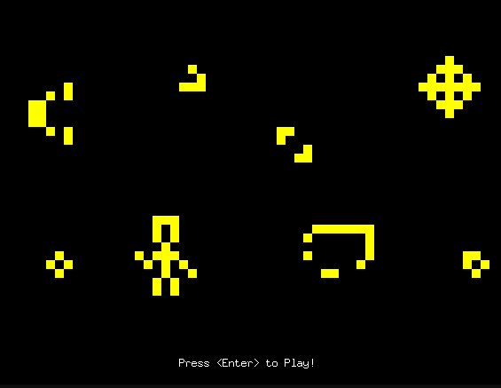

# conways-game-of-life-go

## Preview

This is an implementation of Conway's Game of Life in Go. The Game of Life, also known simply as Life, is a cellular automaton devised by the British mathematician John Horton Conway in 1970.
